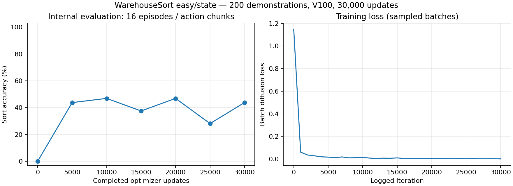

# Easy/state full-data 30,000-update run

Status: **completed successfully**, 30,000 optimizer updates on all 200 demonstrations.

## Results

- Training wall-clock time: **2,409.97 seconds (40 min 10 sec)**, including setup within the
  trainer and seven internal evaluations; excludes package installation and preflight.
- Best internal sort accuracy: **46.875%**, model after **10,001 updates** (earliest tie).
- Last model: **30,000 updates**, internal sort accuracy **43.750%**, all-placed rate **12.5%**.
- Final best-model evaluation: **35.0% sort accuracy**, **14/40 parcels**, **20 episodes**,
  **0/20 fully solved episodes**, mis-sort rate **0%**. Runtime **220.85 seconds (3 min 41 sec)**.
- Final environment seeds: **100000–100019**, verified disjoint from **1000–1199** demo seeds.
- First logged batch loss **1.146294** → last **0.001024**. The task score is not monotonic
  with batch denoising loss; these losses are sampled training batches, not held-out losses.
- Both checkpoint weight sets (agent/EMA) passed finite-value checks. The final evaluator's
  loaded-file hash matches the selected best checkpoint. GPU memory returned to its initial
  idle level after completion; no training process remains active.

### Periodic accuracy

| Completed updates | Internal sort accuracy | All-placed at end | Elapsed |
|---:|---:|---:|---:|
| 1 | 0.000% | 0.0% | 1.38 min |
| 5,001 | 43.750% | 0.0% | 7.98 min |
| 10,001 | 46.875% | 0.0% | 14.56 min |
| 15,001 | 37.500% | 0.0% | 21.04 min |
| 20,001 | 46.875% | 0.0% | 27.55 min |
| 25,001 | 28.125% | 0.0% | 33.70 min |
| 30,000 | 43.750% | 12.5% | 40.16 min |

The internal evaluations really used 16 episodes: two batches of eight. The original log
printed `Evaluated 2 episodes` because it counted batches. After this run, that message was
corrected to use the metric array's size; this display-only change does not change the scores.
Training/evaluation code provenance for this run is commit `b4417c5`.



### Preserved models and records

Both principal models are local under:
`il/baselines/diffusion_policy/runs/warehouse_state_dp_easy_full_30k/checkpoints/`

| Model | File | Actual updates |
|---|---|---:|
| Best by internal sort accuracy | best_eval_sort_accuracy.pt | 10,001 |
| Last | last.pt | 30,000 |

Periodic `0.pt`, `10000.pt`, `20000.pt` and best success-metric snapshots are also retained.
Models are not uploaded. SHA256 hashes and byte sizes are in the JSON result file.

- [Full machine-readable results](easy-full-results.json)
- [Exact applied training arguments](easy-full-effective-config.json)
- [Python, package, GPU and code provenance](easy-full-environment.json)
- Local training stdout: `runs/easy-full-training.log`
- Local per-check evaluation history/config/time: `il/baselines/diffusion_policy/runs/warehouse_state_dp_easy_full_30k/`
- Local final evaluation: `runs/easy-full-final-eval.log` and `runs/easy-full-final-eval/metrics.json`

The raw final `mean_steps=100` is the environment's unsolved-episode sentinel in this setup,
not evidence of successful completion in 100 steps. The final rollout executed 199 steps
per episode according to the preserved official evaluator.


## Configuration

Full dataset: 200 demos, 23,000 transitions, state/action dimensions 54/4.
Generation/reset seeds exactly 1000–1199. All demos used.
Official defaults retained: U-Net [64,128,256], embedding 64, obs/act/pred horizons 2/8/16,
100 diffusion steps, AdamW lr=1e-4, betas=(0.95,0.999), weight_decay=1e-6,
500 warmup steps then cosine, EMA power=0.75, batch 256, seed 1, 30,000 updates.

GPU 0 only; 8 internal evaluation environments, 16 episodes/check; 5,000 iteration eval
frequency, 10,000 iteration save frequency. Headless; no video.
Original zero-based scheduling retained: evaluations after completed updates
1,5001,10001,15001,20001,25001,30000. Exact counts are saved alongside loop labels.
Best model selected by internal sort_accuracy, earliest on ties; -infinity initial best
ensures a model is saved even if all scores are zero. Last model always saved at completion.
Atomic checkpoint saves include actual update count and arguments, but not optimizer/RNG
state: inference artifacts, not exact-resume training snapshots.
Effective config, JSONL eval history and wall-clock training summary are saved locally.
Full plan: [easy-full-run-plan.json](easy-full-run-plan.json).

## Final evaluation

Best model: 20 episodes, seeds 100000–100019 (disjoint from all demo seeds), four environments
on the same GPU. PyTorch/NumPy/Python sampling seed 20260915, policy history cleared between
batches. Easy has fixed parcel/bin poses, so new seeds do not establish new-layout generalization.
Official deployed loader uses 16 denoising steps and re-plans each step; internal trainer
checks use action chunks and 100 denoising steps. Report these scores separately.
The unchanged upstream rollout executes 199 steps with max_episode_steps=200.

## Commands

```bash
WAREHOUSE_GPU=0 scripts/train_easy_full.sh
WAREHOUSE_GPU=0 scripts/eval_easy_full.sh
scripts/run_v100.sh scripts/summarize_easy_full.py
```

Training refuses an existing run directory. Models, data and detailed logs remain ignored.
This is personal learning; no submission or publication outside the private repo.

## Preflight

Two updates and two short evaluation episodes validated saved last-model reload and metrics
JSON. An initial NumPy float32 JSON serialization error was corrected with Python float
conversion; the second preflight passed. Dataset audit uses .venv/bin/python (system Python
has no h5py). See [Vulkan follow-up](../docs/VULKAN_TODO.md) for the separate deferred video task.
